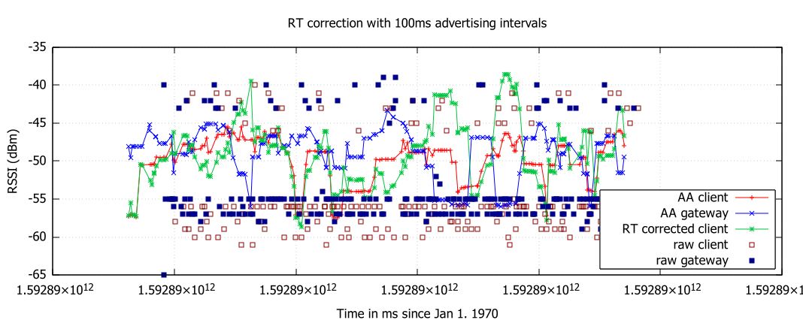
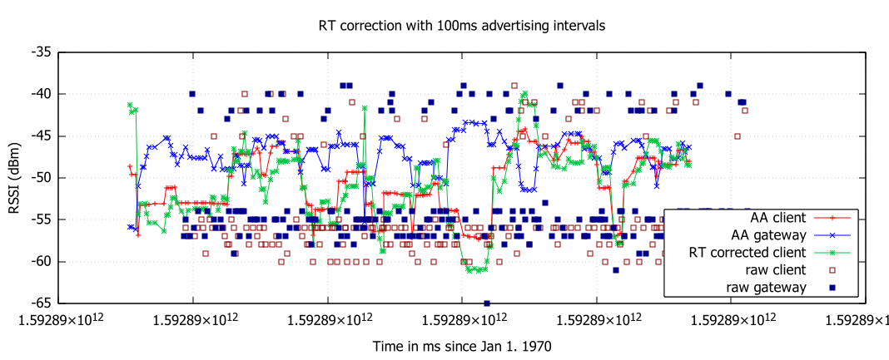
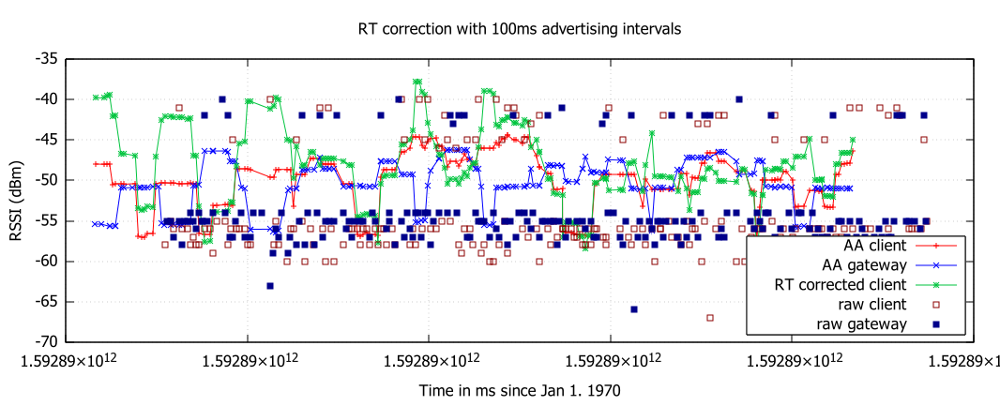
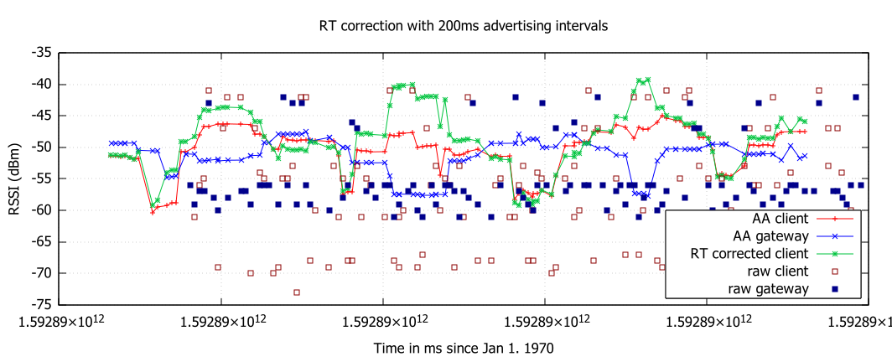
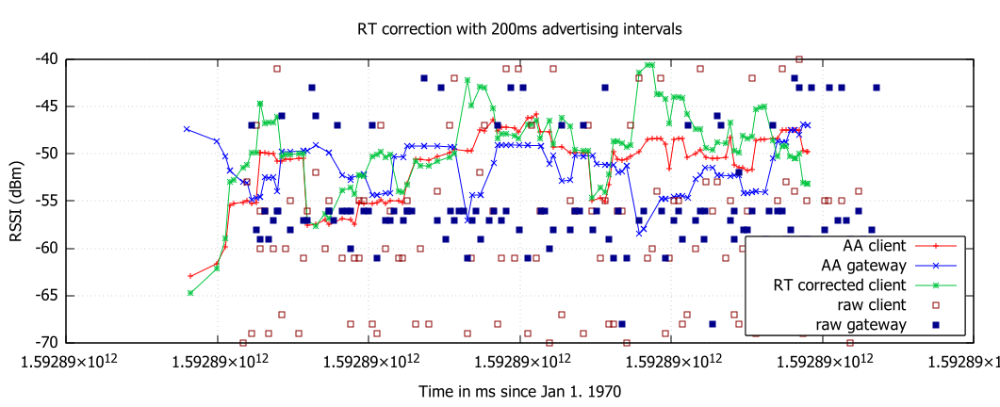
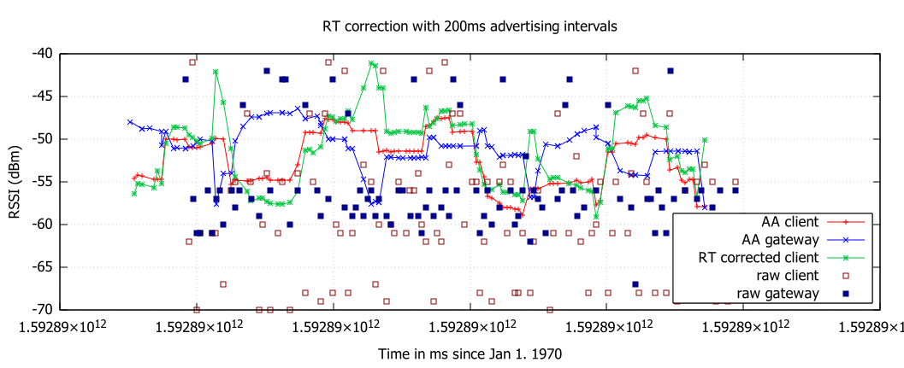
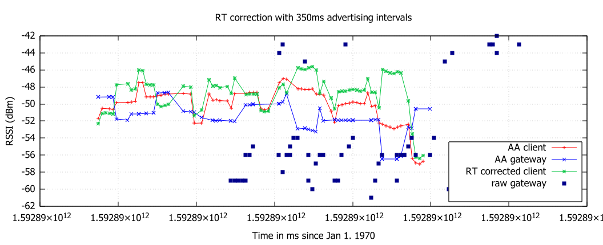
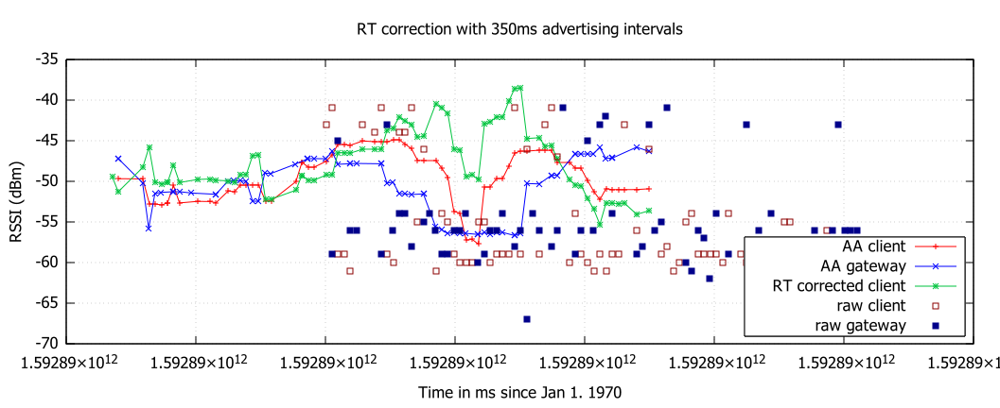
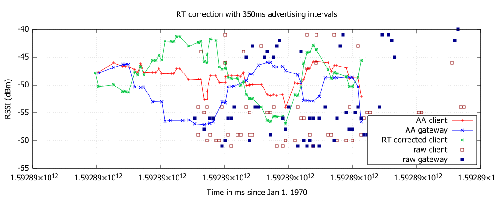

# BLE Advertising Intervals and Real Time RSSI Correction Results

All graphs are based on 20s of measurements. Note that the density of the data points decreases with increasing advertising intervals. There still does not appear to be any mentionable similarity in the fluctuation of gateway and client RSSI, so the green correction line has a higher variance than the original client values.

## 100ms

## 200ms

## 350ms

