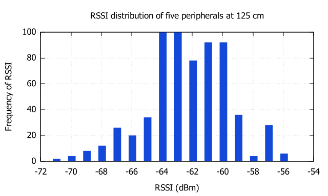

# Charts and Graphs
All data and plot files are available at [ble-ips-files/RSSI_measurements/05-23](https://gitlab.com/mark-matura/ble-ips-files/-/tree/master/RSSI_measurements/05-23).
## Influence of Stands on RSSI Measurements

### Individual runs with standard deviation and mean

## Difference in curve fitting methods

### Hybrid regression vs. pure least squares regression

### PLM curve of without stand

## RSSI distribution at increasing distance
### Combined Measurements from 5 BLE Peripherals

### Measurements from single BLE peripheral

