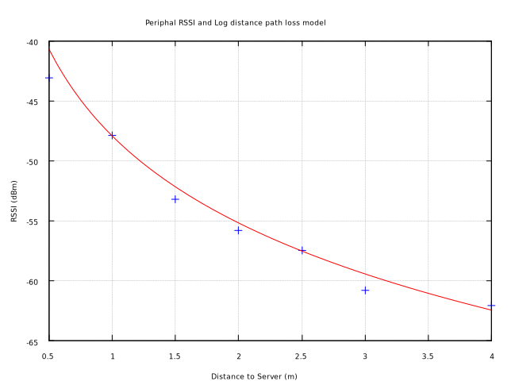
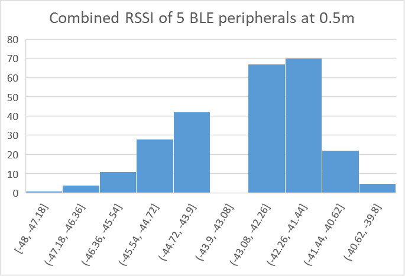
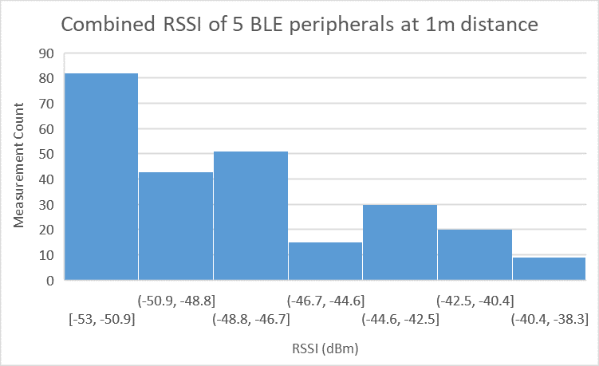
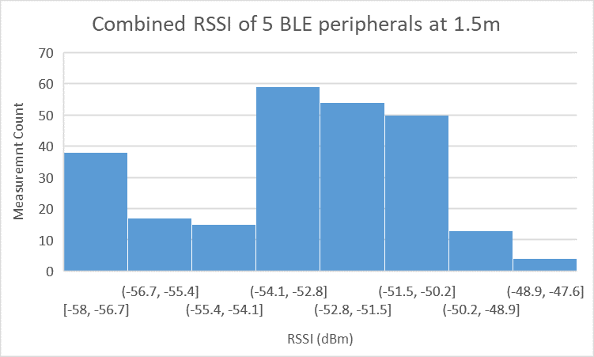
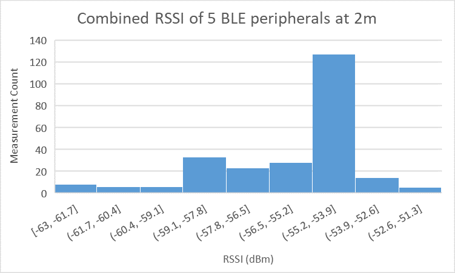
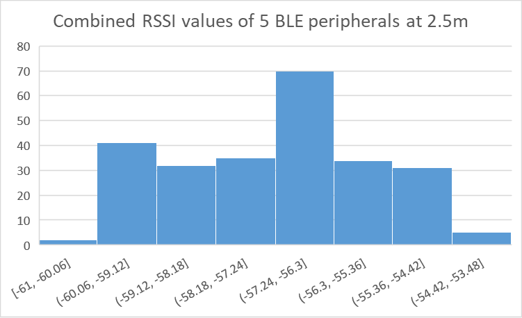
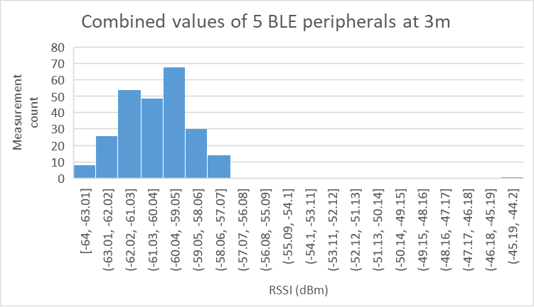
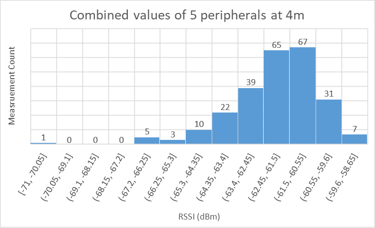

# Path loss constant and RSSI distribution

## Path loss model
The power loss of a signal is a function of the distance.

$$RSSI =  -10n \log(\frac{d}{d_0}) + A_0$$

$n$ is a constant signal propagation exponent that is specific to the testing environment. $A_0$ is a RSSI value taken at distance $d_0$. Setting $d_0$ to 1 removes the fraction and thus $A_0$ assumes the RSSI value at 1m.

The measurement data is available at [https://gitlab.com/mark-matura/ble-ips-files/-/tree/master/RSSI_measurements/05-10_path_loss_parameters](https://gitlab.com/mark-matura/ble-ips-files/-/tree/master/RSSI_measurements/05-10_path_loss_parameters).


## Average RSSI at varying $d$
| Distance (m)                  | 0.5     | 1        | 1.5     | 2       | 2.5      | 3        | 4        |
| ----------------------------- | ------- | -------- | ------- | ------- | -------- | -------- | -------- |
| Average RSSI (dBm)            | -43.092 | -47.916  | -53.212 | -55.812 | -57.476  | -60.776  | -62.036  |
| Standard Deviation RSSI (dBm) | 1.47657 | 3.741247 | 2.3317  | 2.25321 | 1.689034 | 1.778335 | 1.705973 |

The standard deviation is not bad for the averages but is subject to larger fluctuations with certain devices.

## Least squares based regression
I ran these numbers through [GnuPlot](http://www.gnuplot.info/) to pass the data through some linear regression.

```
degrees of freedom    (FIT_NDF)                        : 6
rms of residuals      (FIT_STDFIT) = sqrt(WSSR/ndf)    : 1.25371
variance of residuals (reduced chisquare) = WSSR/ndf   : 1.57178

Final set of parameters            Asymptotic Standard Error
=======================            ==========================
n               = 2.41514          +/- 0.1279       (5.296%)
```

According to GPL the signal propagation exponent of my living room is $2.41514$ based on averages of 350 measurements and linear regression. It remains to be seen how accurate this is.

According to Wikipedia it is comparable to an [office with a soft partition at a signal frequency of 1.9GHz](https://en.wikipedia.org/wiki/Log-distance_path_loss_model).

Curve fit of $p(d)$ in respect to $d$ where $A_0$ is -47.916 dBm and $n$ is 2.41514.



## Distribution of RSSI measurements (Histograms)
The distributions seem to be of gaussian form. That is nice, since the kalman filters described in [05-10 noise reduction](/journal/2020-05-10.html) are valid.







