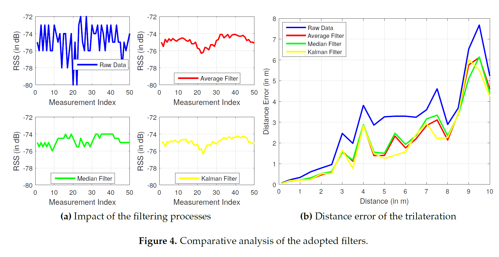
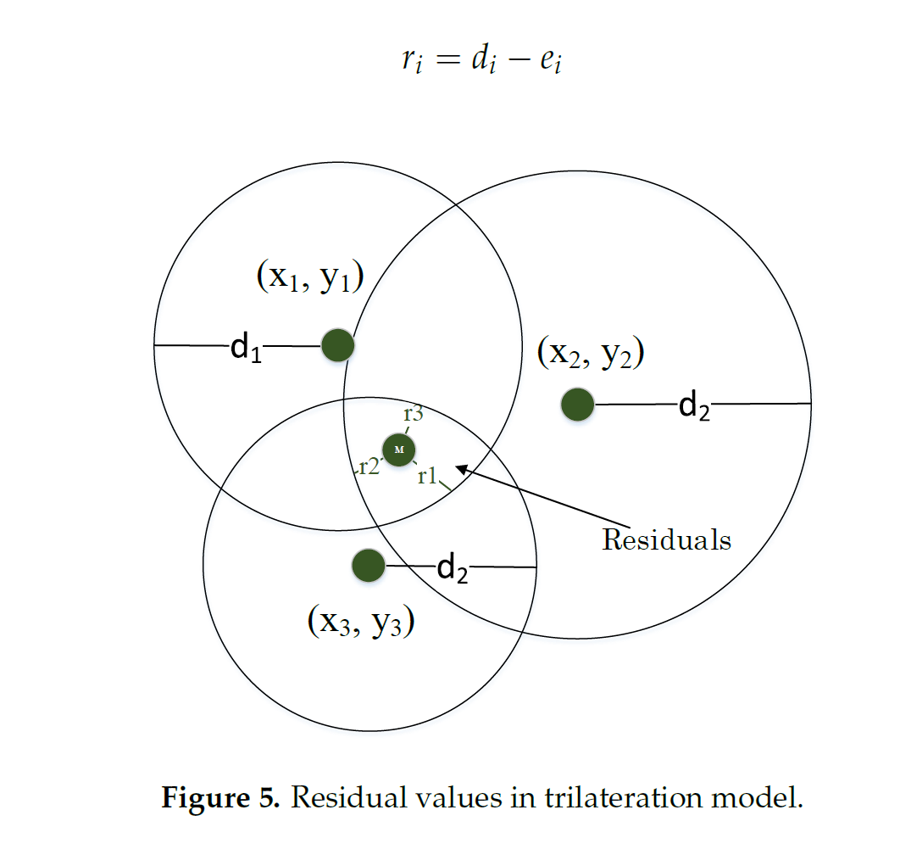
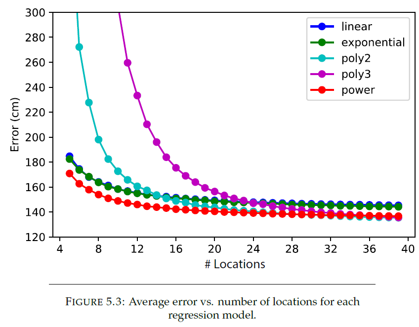

# RSSI positioning

Ich sammle hier die Takeaways von Arbeiten anderer. Zweck meiner Bemühungen ist die Beschaffung eines Überblicks, sodass ich meine Ziele realistischer setzen kann. Ich möchte von den Erfahrungen anderer lernen und auf diesen meine Arbeit aufbauen.

## An improved BLE Indoor Localization with Kalman-Based Fusion: An Experimental Study
- [Direkter Link zur Quelle](https://www.google.com/url?sa=t&rct=j&q=&esrc=s&source=web&cd=11&ved=2ahUKEwiVub-AnKfoAhUJyKYKHdDsA5QQFjAKegQIBhAB&url=https%3A%2F%2Fwww.mdpi.com%2F1424-8220%2F17%2F5%2F951%2Fpdf&usg=AOvVaw0Hb0Ivd8yvVJdhzGGTpgP3)
- [Lokaler Link](./assets/An_improved_BLE_Indoor_Localization_with_Kalman-Based_Fusion_An_Experimental_Study.pdf)

### Choices for Communication Technology Standards
Wifi, Bluetooth und BLE sind die gängigsten.

| Communication Standard | Signal Rate | Normal Range | Transmission Power |
|------------------------|-------------|--------------|--------------------|
| WiFi                   | 54 mbps     | 100m         | 20dBm              |
| Classic Bluetooth      | 1mbps       | 10m          | 10dBm              |
| BLE                    | 720kbps     | 10m          | 1dBm               |

- BLE werden nicht stark von der Umgebung beeinflusst (Möbel in Zimmer o.Ä.). BLE hat höhere sampling rate --> einfacher, Ausreisser zu finden.
- Kalman filtering für Verfeinerung der RSSI Messdaten
- Dead reckoning mit Sensordaten (Accelerometer, Kompass) --> wird schnell kompliziert
- Wifi Fingerprint Methode (Hash von allen Positionensdaten in DB speichern) ist sehr zeitaufwendig. RSSI Signale haben grosse Varianz --> komplex, besonders für grosse Gebäude!!
- Wifi ist intrinsisch ungenauer als BLE, hat höhere Reichweite
--> Hybrid Methoden können Mängel der einzelnen Verfahren ausmerzen

### RSSI Problem 1: Multipath and Fading
Radiosignale werden von Objekten in der Umgebung reflektiert und führen zu mehreren Signalpfaden. Durch Interferenz werden RSSI Messdaten verfälscht. Das Signal verblasst.

Das log-distance path loss Modell ist eine bekannte Art, RSSI Werte in eine Distanz umzuwandeln. Man muss das BLE Gerät für den Raum "kalibrieren" indem man in fixen Abständen unter gleichen Umständen RSSI mit der Distanz vergleicht. Dann hat man einen Exponent für das log-distance path loss model, welches die Reinheit des Raumes beschreibt.

### RSSI Problem 2: RSSI Filtering
Median und Mittelwert:  
Viele Messwerte --> höhere Genauigkeit, doch Daten sind schnell veraltet

Kalman Filtering:  
Macht die Datenkurve flacher und eliminiert somit den Einfluss von Ausreissern. Muss mit experimentell herausgefundenen Parametern versehen werden. Unten stehen Mean, Median und Kalman Filters im Vergleich, der Filter kann am besten die Kurve abflachen. 

### RSSI Problem 3: Tri- oder Multilateration
Trilateration zeichnet einen Kreis um eine der mindestens 3 nodes. Das System ist überdeterminiert (3 Gleichungen, 2 Unbekannte) --> keine eindeutige Lösung:  

Aufgrund des path loss models werden gemessene Distanzen von über 4m in ihrem Algorithmus ignoriert.

The accepted distance is incremented each iteration in search of at least three distances < 3m. Above 10m the thread stops. Otherwise, position is trilaterated and the average filter applied.

Scheinbar beeinflusst die Ausrichtung der Antennen die Signalstärke, was die Genauigkeit vermindert. Wasser absorbiert Signale --> Menschen sind auch Hindernisse 

Der nächste Teil des Berichtes befasst sich mit der Berechnung der Position mithilfe von "Dead reckoning". Die Idee ist, dass man von einem bekannten Ausgangspunkt die Schritte des Nutzers (Accelerometer) misst mit der Ausrichtung (Magnetfeld) zu einer Position verarbeitet. Ich habe nicht vor, ein Produkt für Menschen zu entwickeln. Deswegen ignoriere ich diesen Teil. Bei dead reckoning werden Messfehler summiert, weshalb sich für langzeitige benutzte Anwendungen andere Methoden empfehlen.

Hier wurden Bluefruit LE Friend (BLE 4.0) beacons benutzt. Ein Samsung Galaxy TAB verarbeite den Datenstream und speicherte ihn in Textdateien.

## Cloud-Based Indoor Postioning - ESP32 Client
- [Direkter Link:](http://rvs.unibe.ch/research/pub_files/Cloud-Based_Indoor_Positioning-ESP32_Client.pdf)
- [Lokaler Link:](./assets/Cloud-Based_Indoor_Positioning-ESP32_Client.pdf)
Lokalisierungsversuch wird mit Wifi und pedestrian dead reckoning gemacht. Ein zentraler Server verarbeitet die Daten. Weil man die grossen Berechnungen einem Server überlässt, können mehrere mobile Geräte getrackt werden. Clients müssen lediglich Daten sammeln.

Eine dynamische Auswahl von Regressionsmodellen verbessert die Ranging Genauigkeit. Statische alternativen funktionieren nicht so gut.

### Theoretical Background
Es braucht ein geeignetes Datenvermittlungsprotokoll und Datenformat.
#### Protokoll
TCP ist besser als UDP für Text. WebSocket ist toll. HTTP headers werden upgegradet --> websocket

#### Datenformat
Wenig auxiliary chars --> weniger bits, more performance
JSON ist gut, sehr bekannt und ist gut lesbar für Menschen.

Regressionsmodelle:
- Linear
- Exponential
- Quadratic polynomial
- Cubic polynomial

Die empfangene Signale eines Nodes enthalten ihre Position, Signalstärke und Distanz. Diese können dann in verschiedenen Regressionsmodellen benutzt werden. In diesem Bericht erstellt man ein Modell des Raums, um ein geeignetes Regressionscocktail anzuwenden. Es scheint genauer zu sein als statische Regression für alle Szenarien.

Ein Hampel Filter entfernt die Ausreisser von den letzen Messungen und nimmt dann den Mittelwert der übrigen. Man braucht eine hohe sampling rate.

Vermeintlich ist der Fehler bei Bluetooth Systemen hier etwa 3.5m.

### Data Persistence
Data persistence ist ein Problem von Webserver. Asynchronous function request sparen CPU Nutzung. Load balancing ist wichtig um CPU Load zu verteilen.

Der Server speichert
- Experiment Data
- System Data:
    - GPS Daten vom Client
    - Access Networks und ihre Position
    - Parameter für Regressionsmodelle
    - Trainingsdaten für Regression
    - Signalstärke von allen Trainingsgeräten
- User Data: Rohe Daten vom Client

ESP32 schicken RSSI Daten, Accelerometer, gyroscope und magnetometer readings. <b>Der IEEE 802.11 Standard lässt nur sampling rates von ~0.5Hz zu, weil RSSI Daten ausschliesslich an bestimmten beacon frames angeheftet wird. Diese werden an nur definierten Intervallen gesendet.</b>

### Server Configuration
OpenStack was used as a virtualization platform.
- Ubuntu 16.4 was used as operating system.
- Python 3.6 was the programming language used for the implementation.
No code was directly written in any other language.
- SQLite 3.11.0 was used for persistent data storage.
- Nginx 1.10.3 was used as a load balancer.

### ESP32 Microcontroller as Client
Hier wurde ESP32 mit separaten Wifi- und Sensormodulen benutzt. Programmiert wurde das ganze mit der Arduino IDE. Espressif Systems und die Arduino Entwicklungsumgebung stellen gute APIs zur Verfügung.

- WiFi: WiFi for ESP32
- WebSocket: Websocket client for Arduino, with fast data send
- UART: HardwareSerial for ESP32
- MPU9250: MPU9250_asukiaaa
- JSON: ArduinoJson
- Queue: QueueList Library for Arduino
- Time: Time for ESP32

Diese Anwendung fokussiert sich sehr stark auf Skalierbarkeit des Systems. Darum wird viel über concurrency, asynchronous requests und websockets gesagt. Vermeintlich kann ihr Server 100'000 Clients per CPU core gleichzeitig bedienen. Meine Bedürfnisse sind mehr bescheiden, aber ich finde dennoch die Ideen sehr interessant.

## Indoor Navigation
- [Direkter Link:](https://www.researchgate.net/publication/300068494_Indoor_NavigationIndoor_Positioning_with_mobile_Devices)
- [Lokaler Link:](./assets/IoSL-INav_documentation.pdf)

### WiFi-Based Positioning
Beacon frames sind die Signale, welche für die Positionierung benutzt werden. Down-link oder up-link beacon frames lässt Access points und client wissen, dass sie WiFi traffic entgegennehmen.

Fingerprinting und Trilateration sind Methoden um Geräte zu positionieren. Beim Fingerprinting werden Signaldaten mit einem vorher gesammelten Datenset verglichen. Damit werden die besten Resultate erzielt, aber es bedingt, dass man vorher viele Daten sammelt.

Wifi basierte Lokalisierung ist allgemein eher ungenau.

### Bluetooth-Based Positioning

Die Signalstärke nimmt logarithmisch ab wenn die Distanz erhöht wird.

### Bluetooth Low Energy

Bluetooth Low Energy - The Developer’s Handbook” ist scheinbar ist gutes Buch.

Operation on 2.4 GHz ISM band. It’s an overused band and has bad characteristics as
it is heavily absorbed by water which is the biggest part of the human body. But also
no license fees are taken to operate on this band and therefore, “choosing to use the ISM
band lowers the cost”

Von Beacons kann eine Reichweite von 40-50m erwartet werden. BLE ist robust, billig und verbraucht wenig Strom.

### Architektur
Es gibt hier zwei zentrale Server. Der REST API Server nimmt Requests entgegen und unterstützt CRUD Operationen zusammen mit dem MongoDB Server.

### Probleme
Beacons haben schnell kein Akku mehr. Problematisch war auch, dass die Beacons mit dem iBeacon Protokoll von Apple funktionierten. Hier ist eingebaut, dass (warum auch immer) 30s lang vergehen bis das Apple iBeacon SDK die Nichtverfügbarkeit eines BLE Beacons meldete. Deswegen konnte man nicht in Echtzeit die Position der Menschen verfolgen. Die Anwendung war einen Personenlokalisierer für die Mensa an der Uni. Schlussendlich entschieden die Entwickler, dass man direkt als Nutzer seine Position auf der Karte manuell anzeigen sollte. Das geht für meine Anwendung nicht und erklärt auch die Absenz eines langen Abschnittes über Trilateration.

Data persistence wurde mit MongoDB gelöst. Sie benutzten ein mongoose framework für geofencing, welcher unter vielen Bugs und Kompatibilitätsproblemen litt. Ich denke, dass ich deswegen eher von solchen high-level frameworks fernbleiben sollte.

Dieser Bericht ist sehr fokussiert auf bestimmte APIs von Cisco Router von der Technischen Hochschule Berlin. Ausserdem werden sehr viele Einzelheiten der iOS und Android Applikationen angeschaut (scheinbar ist iOS Entwicklung ein Albtraum)