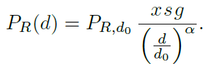
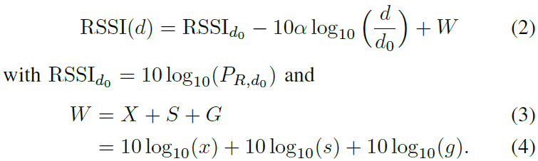

# BLE-trilateration

## Improving trilateration for indoors localization using BLE beacons
- [Direkter Link:](https://morelab.deusto.es/media/publications/2017/conferencepaper/improving-trilateration-for-indoors-localization-using-ble-beacons.pdf)
- [Lokaler Link:](./assets/improving-trilateration-for-indoors-localization-using-ble-beacons.pdf)

iBeacon wurde an der WWDC von Apple im Jahr 2013 eingeführt. Eddystone ist ein Protokoll von Google aus dem Jahr 2015. Das Eddystone Beacon Format kann Informationen nur in eine Richtung übertragen (unidirection communication).

RSSI ist die Stärke des Signals wenn der Empfänger erreicht wird. Sie hängt von der Distanz zwischen den Geräten und der Ausstrahlungsstärke ab. Viele Beacons geben ein ```enum``` zurück mit immediate, near, far.
### ALGORITHM FOR INDOOR LOCALIZATION
Mit 3 Nodes ist das System überdefiniert. Trilateration hat 2 Punkte als Resultat. 4 Nodes hat nur eine Lösung. 3D Trilateration ist sinnvoll für GPS. Für Innenräume reicht 2D aus. Trilateration ist nicht genug, Objekte zwischen Sender und Empfänger und sinkender Batteriepegel beeinträchtigen Genauigkeit --> zuerst RSSI filtrieren.

The accuracy function is intended to be executed after estimating user’s (X,Y) coordinates since it tries to improve its accuracy based on a set of already computed user locations, thus, trilateration calculus is a black box for the accuracy function in the sense that the latter one just takes the several output values from the former one.

Bevor eine Position angegeben wird, versucht nimmt man den Schnitt von 5 Messungen um auf eine Position zu kommen.

Diese Gruppe benutzte Eddystone Beacons. Auf der Server Seite läuft ein node.js web server mit PouchDB.

Beacons sollen nicht in einer Reihe (auf der gleichen Achse) platziert werden. Es hilft, wenn sie an der Decke befestigt sind.

It is highly recommendable to apply different others filters or data processing after initial distance estimates due to latter’s inaccuracy, thus easing localization

## On the Crucial Impact of Antennas and Diversity on BLE RSSI-based Indoor Localization
- [Direkter Link:](https://www.research-collection.ethz.ch/handle/20.500.11850/354276)
- [Lokaler Link:](./assets/On-the-Crucial-Impact-of-Antennas-and-Diversity-on-BLE-RSSI-based-indoor-localization.pdf)

This papers focusses on the influence of indoor channel characteristics and hardware imperfections on the fluctuation of RSSI values.
The polarization / orientation of on-chip antennas can lead to large RSSI drops. Increasing diversity significantly reduces the root mean squared error of distance estimates. They suggest a calibration scheme to estimate path loss components of the path loss model based on a simple training walk.

The path loss model relates the signal power to the distance. The actual power P_r for variable distances d is approximated in P_r,d0 by 4 parameters.<br>


alpha is the environment dependent path loss exponent. X represents small scale fading due to multipath propagation, s models possible shadowing due to objects blocking the line of sight, g  accounts for the orientation of transmitter and receiver. g is variable and therefore not a constant.<br>


Exploiting a high number of diversity recovers the normal properties of X + S so that X tends toward a constant.
The standard deviation of G caused by random antenna orientations on both transmitter and receiver side amount to 6.94 dB. Increasing the diversity order can significantly reduce the root means squared error.
The calibration walk consists of multiple RSSI measurements at all anchors for a mobile agent with a known trajectory.
The rest is about the isolated influences of all of these parameters and their own dependencies. The paper then goes into detail about using their findings to reduce the RMSE of their estimations. It is quite impressive work, since they reduced the RMSE to just 1.36m!

This whole paper was really hard to understand for me since I have no clue about statistics and regression models. It was very interesting the hear about their suggested improved path loss model and calibration techniques. Below I list the my takeaways from this document.

### Takeaways:
- at least 3 diversity branches should be used to mitigate the impact of fading.
- Anchors that are close to the agent are more reliable and high anchor densities are thus desirable.
- The antennae of the modules should all point in the same direction to reduce variations in the RSSI
- Before starting out with the calculations, I should work out the path loss exponent for the test environment (possibly with their calibration scheme)

It would be very interesting to be able to read about this:
https://ieeexplore.ieee.org/document/8905164

The problem is that they require some sort of a subscription in order to read it. :(