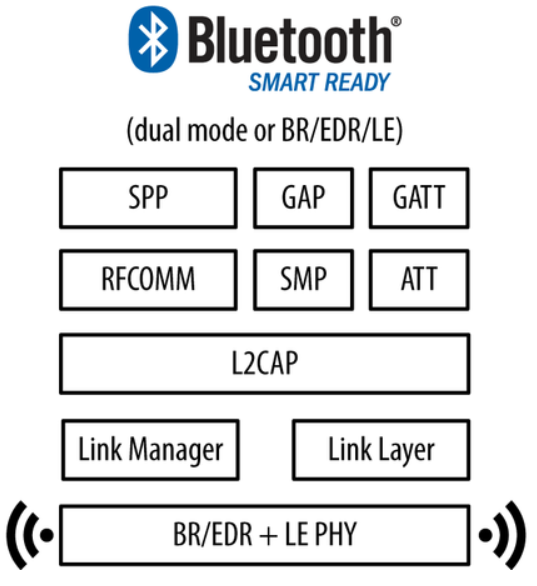

# BLE key terms

## BLE Standard

Der Ble Standard erschien im Jahr 2010 und wurde schnell von vielen grossen Firmen wie Samsung und Apple unterstützt. Grund für diese rasche Beliebtheit ist die Tatsache, dass der Standard sehr robust, kompakt und einfach ist.

Mein Board ist ein dual mode Bluetooth Board. Das heisst, dass Bluetooth BR/EDR (classic Bluetooth) und BLE unterstützt sind. Dieses Diagramm zeigt die Konfiguration von dual mode Bt:

## Generic Attribute Profile (GATT)
[https://developer.android.com/guide/topics/connectivity/bluetooth-le](https://developer.android.com/guide/topics/connectivity/bluetooth-le)

[Link](https://www.oreilly.com/library/view/getting-started-with/9781491900550/ch01.html)

Ist die Spezifikation für die Datenübertragung über einen BLE Link.
GATT kommt erst ins Spiel wenn man eine Verbindung zwischen zwei Geräten hat. Das heisst, dass man bereits den advertising process mit GAP durchgemacht hat.

## Network Topology
BLE Geräte haben 2 Wege um mit der Aussenwelt zu kommunizieren: Broadcasting oder Connections. Das General Access Profile enthält Richtlinien für diese Kommunikationsarten.  Der grundlegende Unterschied zwischen den beiden ist die mögliche Netzwerktopologie. Broadcasters können Information an mehrere Observer senden. Die Kommunikation fliesst nur in eine Richtung. Connection erlauben den Datenaustausch in beide Richtungen aber können nur 2 Peers verbinden. Beide Möglichkeiten würden für mich funktionieren, da ein zentraler Client Hub connections zu allen peripheral slave servers machen kann.

### Nomenklatur BLE `Server` und `Client`

Man soll zur Kenntnis nehmen, dass ein BLE SERVER nur mit <b>einem</b> zentralen BLE CLIENT aufs Mal verbunden sein kann. Das zentrale Gerät kann aber mit mehreren SERVER verbunden sein. Dabei sind die peripheralen Geräte die Serv und das zentrale Gerät ist der Client. Die Nomenklatur tönt ein bisschen komisch, da bei Webservern der Server meistens das zentrale Gerät ist, mit dem sich Clients verbinden. Das Gegenteil gilt bei BLE Links. Eigentlich macht's aber Sinn, weil die Datenanbieter ("Server") die peripheralen Geräte sind.

Der Client startet die Transaktionen und erhält einen Response von den Slaves. Kommunikation von Slave to slave und master to master ist nicht möglich.

Das Bluetooth SIG hat einige verschiedene Profile erstellt. Eines, das ich wahrscheinlich brauchen wird ist das [TX POWER SERVICE](https://www.bluetooth.org/docman/handlers/downloaddoc.ashx?doc_id=239393) Profil. Damit kann man den TX power level characteristic verfolgen. Daten werden hin und her geschickt mit Services und Characteristics. Man benutzt ein Attribute Protocol (ATT) um Services und Characteristics in einer Tabelle mit 16 Bit IDs zu speichern.

[Link](https://learn.adafruit.com/assets/13828)

ESP32 GATT Server API: [https://docs.espressif.com/projects/esp-idf/en/latest/esp32/api-reference/bluetooth/esp_gatts.html](https://docs.espressif.com/projects/esp-idf/en/latest/esp32/api-reference/bluetooth/esp_gatts.html)

use this to find out about the transmitting power
specification
[https://www.bluetooth.com/specifications/gatt/](https://www.bluetooth.com/specifications/gatt/)
